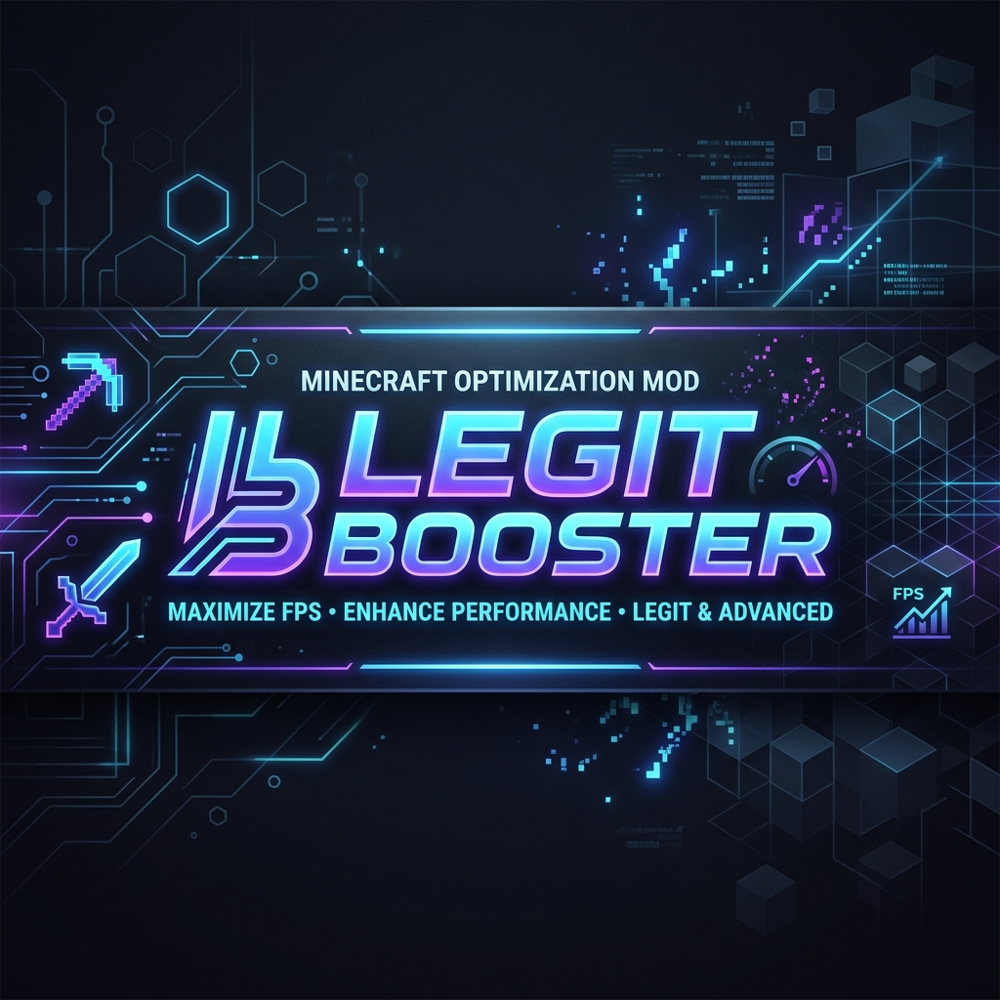

  

<h1 align="center">LegitBooster</h1>

  <a href="README.md">🇺🇸 English</a> | <a href="README-tr.md">🇹🇷 Türkçe</a> | <a href="WIKI.md">📖 Wiki (EN)</a> | <a href="WIKI-tr.md">📖 Wiki (TR)</a>

  

  
  
  
  

  

## 🌟 Proje Hakkında

**LegitBooster**, Fabric için özel olarak tasarlanmış, *tamamen "legit" (hilesiz görünen)* gelişmiş bir yardımcı moddur. Temel amacımız, büyük sunuculardaki anti-hile sistemlerini (Anti-Cheat) **tetiklemeden**, size PvP avantajı, oynanış kolaylıkları ve devasa FPS optimizasyonları sunmaktır.

Sıradan hile istemcilerinin (hacked client) aksine, LegitBooster ince detaylara odaklanır: rastgele gecikmeler, insansı hareketler ve sunucu tarafındaki kontrollere tamamen doğal görünen envanter yönetimi.

## ✨ Temel Özellikler

  

- **⚔️ Gelişmiş PvP Araçları:** İnsansı Jitter tıklama (AutoClicker), rastgele atma gecikmelerine sahip AutoSoup ve daha fazlası.
- **🚀 FPS Arttırıcı:** Yoğun savaşlar sırasında yüksek kare hızlarını (FPS) korumak için entegre render optimizasyonları.
- **🏗️ Akıllı Köprü (Bridging):** Hızlı köprü (speed-bridge) tekniklerini kusursuz bir şekilde taklit eden NinjaBridge ve JumpBridge özellikleri.
- **🎒 Envanter Yönetimi (InvMove):** Envanteriniz açıkken bile hareket etmeye, koşmaya ve zıplamaya devam edin.
- **🛡️ Eşsiz Gizlilik:** Modern anti-hile sistemlerini (NoCheatPlus, Vulcan, GrimAC vb.) atlatmak için sıfırdan özenle kodlanmıştır.

  

## 🚀 Kurulum Rehberi

LegitBooster'ı kullanmaya başlamak inanılmaz derecede basittir! Modu kurmak için şu adımları izleyin:

1. **Fabric Loader'ı İndirin:** Minecraft **1.16.5** için [Fabric Loader](https://fabricmc.net/use/)'ı kurun.
2. **Fabric API'yi İndirin:** [Fabric API](https://modrinth.com/mod/fabric-api) (1.16.5) modunu indirin ve `mods` klasörünüze atın.
3. **LegitBooster'ı İndirin:** Projenin [Sürümler (Releases) Sayfasına](https://github.com/Abdullaherain0131/LegitBridge-MultiVersion/releases) gidin ve en son `.jar` dosyasını indirin.
4. **Modu Kurun:** İndirdiğiniz `legitbooster-1.16.5.jar` dosyasını Minecraft'ın içindeki `.minecraft/mods/` dizinine yerleştirin.
5. **Oyuna Girin:** Minecraft Launcher'ı açıp kurduğunuz Fabric profilini seçerek oyunu başlatın.

## 🎮 Nasıl Kullanılır & Yapılandırma

LegitBooster "tak-çalıştır" mantığıyla tasarlanmıştır, ancak her şeyi kendi oyun tarzınıza göre özelleştirebilirsiniz.

- **Menüyü Açmak İçin:** Oyun içi LegitBooster Yapılandırma Ekranını açmak için `Sağ Shift` (RSHIFT) tuşuna basın.
- **Modülleri Aç/Kapat:** Şık arayüzü kullanarak modülleri kolayca AÇIK veya KAPALI konuma getirebilirsiniz.
- **Detaylı Rehber:** Hangi modülün ne işe yaradığını mı merak ediyorsunuz? Her bir özelliğin, gecikme ayarlarının ve gizlilik yapılandırmalarının detaylı analizi için **[📖 Resmi Wiki (TR)](WIKI-tr.md)** sayfamıza göz atın!

  

## 🤝 Katkıda Bulunma & Destek

Topluluk katkılarını seviyoruz! Yeni bir modül için fikriniz varsa veya bir hata bulduysanız:
- **[Issue Açın](https://github.com/Abdullaherain0131/LegitBridge-MultiVersion/issues)**: Hata bildirimleri veya özellik istekleri için.
- **Pull Request (PR) Gönderin**: Depoyu kendi hesabınıza çatallayın (fork) ve katkılarınızı bize gönderin.

  <i>Ersin ve Açık Kaynak Topluluğu tarafından ❤️ ile yapıldı.</i>

